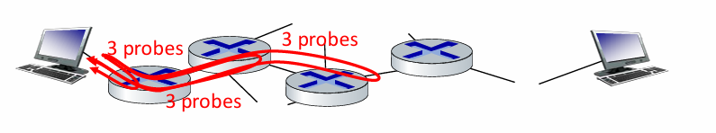
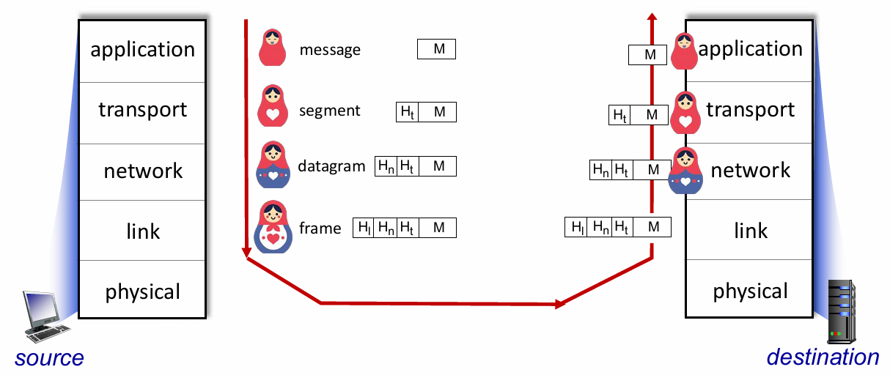

# Chapter 1: Introduction to Computer Networking

## Topics Covered
- What is the Internet?
- What is a Protocol?
- Network Edge: Hosts, Access Networks, Physical Media
- Network Core: Packet/Circuit Switching, Internet Structure
- Performance: Loss, Delay, Throughput
- Protocol Layers, Service Models
- Security (not exam)
- History of the Internet (not exam)

## What is the Internet?
- The Internet is a **network of networks (internet)** connecting billions of devices.
    - **Internet** : mostly refer to whole world
    - **internet** : part of the Internet connected to each other with ISP (Internet Service Provider)
- Consists of **end systems**, **packet switches** , and **communication links** 
- **End systems (hosts)** run **network applications** at the Internet's edge.
- **Packet switches** forward packets (chunks of data) : routers, switches
- **Communication links** transmission rate called bandwidth
    - Physical : fiber, copper
    - Non-physical : radio, satellite

## What is a Protocol?
- A **protocol** defines rules for communication, specifying the format and order of messages sent and received and actions taken on message transmission, receipt.
  - **HTTP/HTTPS** (Web)
  - **TCP/IP** (core Internet protocols)
  - **WiFi**, **4G/5G**, **Ethernet**

## Internet standards
- **Internet standards** are the rules that define the Internet architecture and protocols.
- Request for Comments (RFC) : Internet Standard 
- Internet Engineering Task Force (IETF) : Technology Standard

## Internet Structure
### Network Edge (Hosts)
- **Clients** and **servers** located at the network edge.
- **Servers** often reside in **data centers**.

### Access Networks & Physical Media
Wired & Wireless communication links
- **Residential Access Networks**:
  - **DSL**: Uses telephone lines.
  - **Cable**: Uses coaxial cables.
- **Wireless Access Networks**:
  - **WiFi**: Local access.
  - **4G/5G**: Wide-area access.
- **Enterprise Networks**:
  - Mix of wired (Ethernet) and wireless (WiFi) connections.

### Network Core
Consists of **interconnected routers** forming the backbone of the Internet.

#### Packet Switching vs Circuit Switching
**Packet Switching**: break app-layer message into smaller packets, forward packet **from one router to the next**, across link on path from source to destination, shared network resources, great for bursty data, simpler no call set-up.

`source->R1->R2->destination`

- Two key network core functions
    - **Forwarding (switching)**: local action (router), **which router output link** based on header value
    - **Routing**: global action determine source to destination path
- **Store and forward** : entire packet must arrive before transmitted to next link
- **Queueing**: work arrival rate exceeds transmission rate, Buffer
    - **Packet Loss**: packets can be dropped (lost) if memory (buffer) in router is full

**Circuit Switching**: end-end allocated, reserved for "call" between source and destination, dedicated path for communication (No sharing so guaranteed performance).
-   Frequency Division Multiplexing (FDM) : Deviced by frequency, radio
-   Time Division Multiplexing (TDM) : Deviced by time, telephone

## How to sends packets of data
Host sending function:
- **1 byte = 8 bits (careful)**
- break message into smaller chunks **(packets)**, **length L (bits)**
- transmit packets to network at **link transmission rate R (bits/sec) (link capacity, link bandwidth)**
- **packet transmission delay**: time needed to transmit a packet to link
$$packet\_transmission\_delay (sec) = \frac{L}{R}$$

Type of media : what lies between transmitter and receiver
- guided media (solid media)
    - Twisted pair (TP) could be Unshield Twisted pair (UTP), **two insulated copper wires**
        - type : cat5 (100-1000Mbps), cat6(10Gbps)
        - pros : cheap
        - cons : can be disturbed by magnetic wave easily
    - Coaxial cable, **two concentric copper conductor** , bidirectional, use as repeater
    - Fiber optic cable **glass fiber** carring light pulses, each pulse a bit
        - pros : high speed (10-100 Gbps), low error rate 
            - bit error rate (BER) : $10^{-9}$ mean $10^{9}$ bit 1 error
        - cons : expensive and hard to install and maintain 
- unguided media (wireless media) WIFI, Bluetooth, 4G/5G, ...

## Performance
### Metrics
- **Delay**: Time taken for a packet to travel from source to destination.
- **Loss**: Packets dropped if buffer is full, previous node might retransmit.
- **Throughput**: Rate (bits/time unit) at which data is successfully delivered.
    - instantaneous : rate at given point in time
    - average : rate over a period of time
    - Throughput mostly a min(tranmission rate of all link) because of bottleneck link

### Delay Sources
$$d_{nodal} = d_{proc} + d_{queue} + d_{trans} + d_{prop} $$
- **Processing Delay**: Time to process inside router, typically fast **dont care**.
- **Queueing Delay**: Time in router queues, depends on congestion level, not consistent **dont care**.
- **Transmission Delay**: Time to push packet onto the link, depend on packet.
    - `L/R` : L packet size (bit) , R transmission rate (bits/sec)
- **Propagation Delay**: Time for signal to travel through the media.
    - `d/s` : d distance (meter) , s propagation speed (depend on media) (m/sec)

### Traffic intensity
$$\frac{L*a}{R}$$
- `L` : Packet size (bit/packet)
- `a` : Average packet arrival rate (packet/sec)
- `R` : Bit transmission rate (link bandwidth)(bits/sec)
- `~ 0` : avg. queueing delay small
- `~ 1` : avg. queueing delay large
- `> 1` : average delay infinite

### Traceroute program
delay measurement from source to router along path
- sends three packets -> router return packet to sender -> sender measure time interval

## Protocol Layers & Service Models
Because networks are complex , so we try to handle this using Layer system, easy to manage and maintain
- explicit structure allows identification relationship of system's pieces
- modularization eases maintainance, updating of system -> change in layer not affect other
### Internet reference model
- The Internet uses a layered protocol stack:
  1. **Application Layer** (HTTP, SMTP) : supporting network application -> **Message**
  2. **Transport Layer** (TCP, UDP) : process data transfer -> **Segment**
  3. **Network Layer** (IP) : routing from source to destination -> **Datagram/Packet**
  4. **Link Layer** (Ethernet, WiFi) : data transfer between neighboring network element -> **Frame**
  5. **Physical Layer** (cables, radio waves) -> **bit**

### Encapsulation
- Data is encapsulated with headers at each layer.
- E.g., Application message → Transport segment → Network packet → Link frame.

### ISO/OSI reference Model
Two layer not found in Internet protocol stack
- **Presentation** : Allow application to interpret meaning of data (e.g. encryption, compression)
- **Session** : Synchronization, checkpointing, recovery of data exchange

