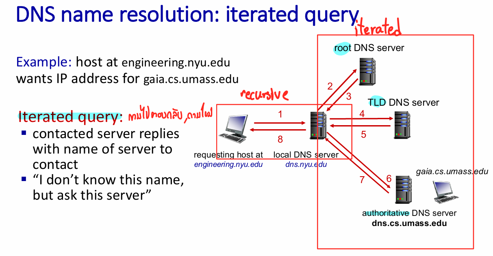
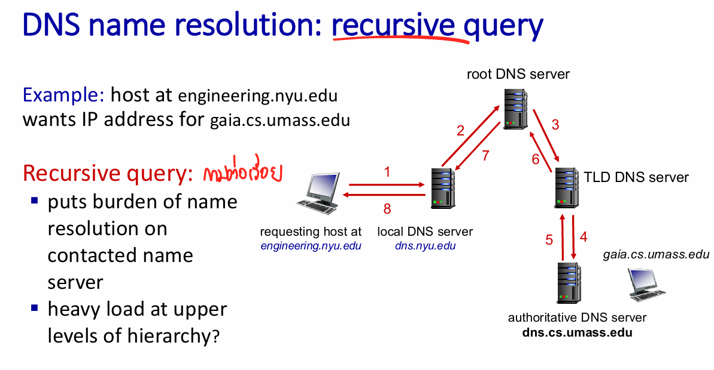
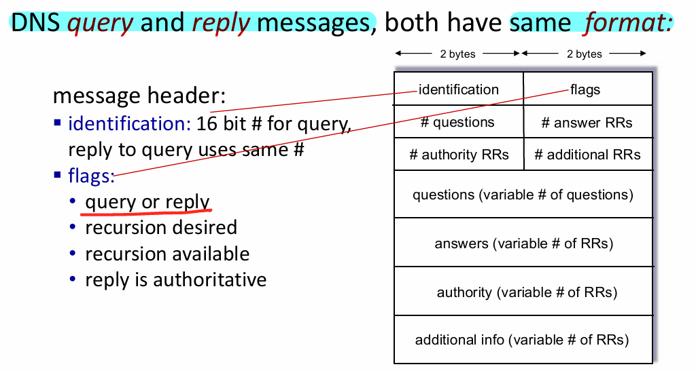
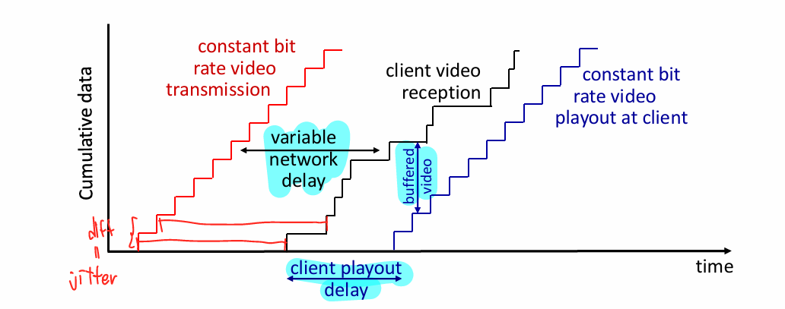

# Chapter 2: Application Layer

## Topics Covered  
- **Principles of network applications**  
- **Web and HTTP**  
- **E-mail, SMTP, IMAP**  
- **Domain Name System (DNS)**  
- **Peer-to-Peer (P2P) applications**  
- **Video streaming and Content Distribution Networks (CDNs)**  
- **Socket programming with UDP and TCP**  

## Principles of Network Applications  
run on different end systems, communicate over network (end to end), network core device do not run app
- **Client-Server Architecture**:  
  - **Server**: Always-on host with a permanent IP address, often at data centers.  
  - **Client**: Communicates with the server, intermittently connect, may have dynamic IP addresses, mostly not directly communicate with other.  
- **Peer-to-Peer (P2P) Architecture**:  
  - **No server**: peers directly communicate and share resources, peer request service from other peers.
  - **Self Scalability**: new peers bring new service to the network, peer are intermittently connected and change IP addresses.
- **Processes Communicating**:  
  - **Process**: program running within a host
    - same host, processes communicate using inter-process communication (shared-memory)
    - different hosts, processes communicate by exchanging message
  - **Client Process**: Initiates communication.  
  - **Server Process**: Waits to be contacted.  
- **Sockets**: Process sends/receives messages to/from its socket, door  
- **Addressing Processes**: เพราะมี process เยอะ, OS จะรู้ได้อย่างไรว่าให้ไป socket ไหน
  - Only IP address is not enough because many processes can be running on the same host.
  - Identifier include **IP address** and **port number** (e.g., HTTP: port 80, SMTP: port 25).  

## Application layer protocol defines
- **Type of messages** : request, response
- **Message syntax**: field in message & how fields are delineated
- **Message semantics**: meaning of information in fields
- **Rule**: when and how processes send&respond to messages

## Requirement of transport service need
- **Data integrity**: reliable (correct and complete)
- **Timing**: low delay
- **Throughput**: some application requirement minimum amount throughput
- **Security**: encryption
## Internet transport protocol
- **TCP**
  - Reliable (complete and in-order) 
  - Flow control won't overwhelm receiver
  - Congestion control won't overwhelm network
  - Connection oriented -> set up required
  - No timing, throughput guarantee, security
- **UDP** 
  - Unreliable (may be lost or arrive out of order)
  - does not provide anything
- **Securing TCP** : Adding transport layer security (TLS) to TCP provides encrypted TCP connections 
  - Implement in application layer : cleartext sent into socket transverse Internet encrypted

## Web and HTTP  
- **HTTP (Hypertext Transfer Protocol)**:  request & response 
  - HTTP with TCP : stateless(no information about past client request) complex to maintain
    - client initiates TCP connection -> server accepts TCP connection (TCP handshake)
    - HTTP messages could exchanged between client and server
    - TCP connection closed 
  - **Non-Persistent HTTP**: Opens a new TCP connection for each object.  
  - **Persistent HTTP**: Reuses the same TCP connection for multiple objects.  
  - **Round Trip Time (RTT)**: go and back (client -> server -> client)
  - **Non-Persistent HTTP response time (per object)**: 2RTT + file transmission time
  - **Persistent HTTP response time (per object)**: one RTT for all objects

- **HTTP Messages**:  
  - **Request Message**: Contains method (GET, POST, HEAD, PUT), URL, and headers.  
  - **Response Message**: Contains status code (e.g., 200 OK, 404 Not Found) and headers. 
    - 200 OK, 301 Moved Permanently, 400 Bad Request, 404 Not Found, 505 HTTP version not supported
  - Unit of content length is **byte**

- **Cookies**: Used to maintain state between HTTP transactions.  
  - Step:
    - Server request set&store cookie (cookie header line in response)
    - Client accept and send request with cookie (cookie header line in request) 
    - Client will have cookie header line in request (cookie file kept on user's browser)
    - Server save cookie in backend database 
  - **Usage**: Authorization, Shopping cart, Recommendations, Web email
- **Web caches**: save possible web page in local web cache (server side).
  - enhance response time, reduce traffic
- **Conditional GET**: Request to server but server don't need to send object if browser is up to date
  - Request header : `If-modified-since:<date>`, if not update : `304 Not modified` No object else normal response with object

## Evolution of HTTP
- **HTTP/1.1**: multiple, pipelined GETs over single TCP connection, server response in-order FCFS
  - problem : head of line (HOL) blocking : small object have to wait for large object
- **HTTP/2**: increased flexibility , client specific object priority -> handle HOL blocking, send unrequested object, divide object to frame
  - problem : single TCP connection so packet loss still stall all object transmission and no security
- **HTTP/3**: add security and using UDP instead of TCP

## E-mail, SMTP, IMAP  
- Three major components:
  - **User agents**: mail reader, not web-based
  - **Mail servers**: incoming for user and queue of outgoing 
  - Protocols
    - **SMTP (Simple Mail Transfer Protocol)**:  
      - TCP to reliably transfer : SMTP handshaking, SMTP transfer of message, SMTP closure
      - Used for sending emails to mail servers.  
      - Transfer between mail servers.
    - **IMAP (Internet Mail Access Protocol)**:  
      - Used for user agent retrieving emails from a server.  
      - Allows emails to be stored on the server and accessed from multiple devices.  
    - **POP3 (Post Office Protocol version 3)**
      - Used for user agent retrieving emails from a server.
      - After retrieving email would be deleted from server.

## Domain Name System (DNS)  
- **DNS**: Distributed database that maps domain names to IP addresses, implement in application layer.
- **DNS Services**:  
  - Hostname-to-IP translation.  
  - Host aliasing (canonical and alias names).  
  - Mail server aliasing.  
  - Load distribution across multiple servers.  
- **DNS Hierarchy**:  
  - **Root DNS Servers**: Top of the hierarchy.  
  - **Top-Level Domain (TLD) Servers**: Manage domains like .com, .org, .edu.  
  - **Authoritative DNS Servers**: Organization's own DNS servers, maintained by organization or service provider.
  - **Local DNS Servers**: not strictly part of DNS hierarchy.
    - first place to query, if found in **local cache** return else forwarding to DNS hierarchy.
- **DNSSEC** : provides security
- **ICANN** : manages root DNS domain 
- Type of query 
  - Iterated Query: local DNS server ถามไปตอบกลับ, ถามใหม่ทุก hierarchy

  
  - Recursive Query: local DNS server ถามรอบเดียว, ไปเรื่อยๆ เอง แล้วค่อยตอบย้อนกลับมา
  
  
- **Caching DNS information**: typically in local DNS servers, cache can timeout after TTL (time to leave), can out of date if named host change IP address
 

## Peer-to-Peer (P2P) Applications  
- ความเร็วในการ upload อาจสั้นกว่าหากมีหลาย file เพราะสามารถ upload โดยใช้หลาย devices
- **P2P File Sharing**:  
  - **BitTorrent**: Divides files into chunks; peers share chunks with each other. 
    - **Tracker** : Server use to track ใครมี file chunk ไหนบ้าง
    - **Torrent** : Group of peers that exchanging chunk of a file
    - Requesting Chunk : Rarest first เพื่อป้องกันไม่ให้ chunk นี้หายไป
    - Sending Chunk : tit-for-tat, ให้คนที่ให้เราก่อน, ทุก 30 วิ random select other peer 

## Video Streaming and Content Distribution Networks (CDNs)  
- **Video**: use redundancy within and between images to reduce # of bits that need to transfer
  - **Spatial**: within images, only send color value and repeated values
  - **Temporal**: between images, only send changes from last frame
  - **Constant bit rate (CBR)**: predictable
  - **Variable bit rate (VBR)**: can use spatial and temporal coding
  - Problem : bandwidth will vary due to congestion so network delay are variable (cause jitter) lead to poor video quality
    - client-side buffering and playout delay : ตอนได้ทีแรกมาจะยังไม่เล่นทันทีเก็บเข้า buffer ก่อน รอพร้อมค่อยรัน

    
  - **DASH (Dynamic Adaptive Streaming over HTTP)**: Adjusts video quality based on available bandwidth/delay.  
    - devides video file into multiple chunks encoded at different rate, then replicated in various CDN node
    - **Manifest file**: บอกว่า file ไหนอยู่ไหนบ้าง
    - **Intelligence at client**: 
      - estimates server-client bandwidth
      - chooses maximum coding rate sustainable given current bandwidth
      - chooses different rate at different point of time based on current bandwidth
- **Content distribution networks (CDNs)**: over the top (network top of network)
  - Distribute content across multiple geographically distributed site.
    - enter deep : deep into many access networks close to user, Akamai
    - bring home : point of presense หลาย network cross, LimeLight
  - Reduce latency and improve performance by serving content from the nearest server.
  - **Single large**: single point failure, network congestion (bottleneck), jitter
    

