# Chapter 3: Transport Layer

## Topics Covered
- Transport-Layer Services
- Multiplexing and Demultiplexing
- Connectionless Transport: UDP
- Principles of Reliable Data Transfer
- Connection-Oriented Transport: TCP
- Principles of Congestion Control
- TCP Congestion Control
- Evolution of Transport-Layer Functionality

## Transport-Layer Services
- Provides **logical communication** between application processes on different hosts.
- Action in end systems
  - sender: break messages into segments, pass to network layer
  - receiver: reassembles segments into messages, pass to application layer
- **Transport Layer vs Network Layer**
  - Transport layer: communication **between processes** using port number
  - Network layer: forwarding segments **between hosts** using IP address
- Two principal Internet transport protocols: UDP and TCP
  - TCP : reliable, in-order, congestion/flow control, connection setup
  - UDP : unreliable, but easy to config
  - both No delay guarantees, bandwidth guarantees
- Responsibilities:
  - **Multiplexing/Demultiplexing**: Using ports to direct data to correct applications.
  - **Reliable Data Transfer**: Ensuring data integrity and order.
  - **Flow Control**: Preventing sender from overwhelming the receiver.
  - **Congestion Control**: Managing network load to prevent congestion.

## Multiplexing and Demultiplexing
- **Multiplexing**: ส่ง handle data from multiple socket, add transport header.
- **Demultiplexing**: รับ use header info received segments to correct socket.
- host uses IP address (network layer header) and port number (transport layer header) to direct segment to appropriate socket.
- Multi/Demultiplexing happen in all layer not just transport layer

### Connectionless Demultiplexing: UDP
- **UDP demultiplexing using destination port number (only)**
- when creating datagram sending to UDP socket must specify 
  - dest IP address
  - dest port number
- when receiving host receives UDP segments, check dest port and direct to that socket
- same dest IP and dest port number will be directed to same socket

### Connection-oriented Demultiplexing: TCP
- **TCP demultiplexing using 4-tuple below**
- TCP socket identified by 4-tuple
  - source IP address
  - source port number
  - dest IP address
  - dest port number
- when receiving host receives TCP segments, check 4-tuple and direct to that socket
- new socket for new process pair

## UDP : User Datagram Protocol
- **best effort service (send and hope for the best)**: lost, out-of-order, connectionless (no handshake)
- Each UDP segment handled independently of others.

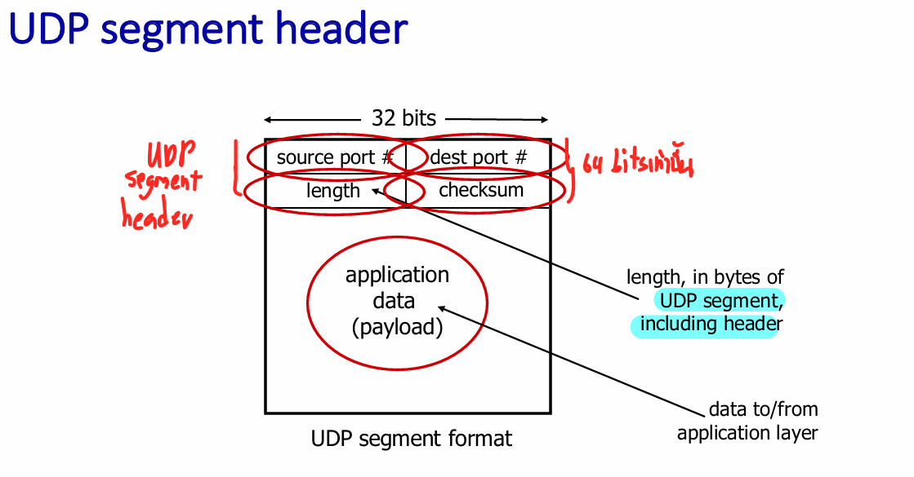
### why is there UDP?
- Small header size (64 bits only)
- No connection establishment so more faster
- Much simpler
- No congestion control so can blast away as fast as desired (good for DDOs)
### Usage
- HTTP/3 : customized add reliability/congestion control at application layer, TCP have something we wasn't need
- DNS, Simple Network Management Protocol (SNMP), streaming multimedia apps, interactive application
### UDP checksum
**Goal : detect errors**, will be done after receive segment form network layer
Sender : treat every content in UDP segments as 16-bit integers including header field and IP addresses, Checksum = one's complement sum of these 16-bit integers
Receiver : compute checksum of received segments 
  - if not equal -> error detect
  - if equal -> not detect yet, but might have 
#### One's complement sum
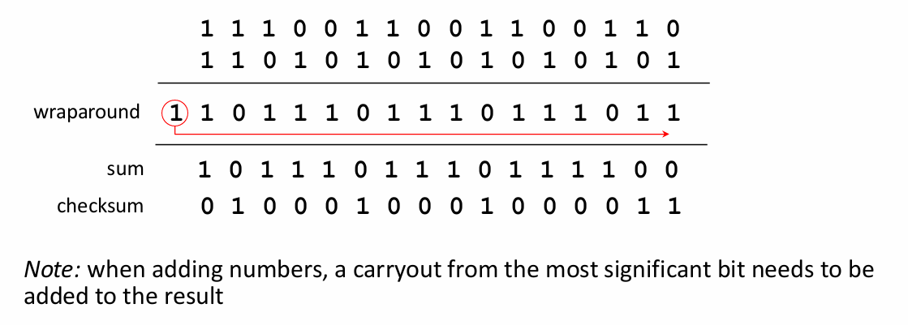
#### Checksum not detect error
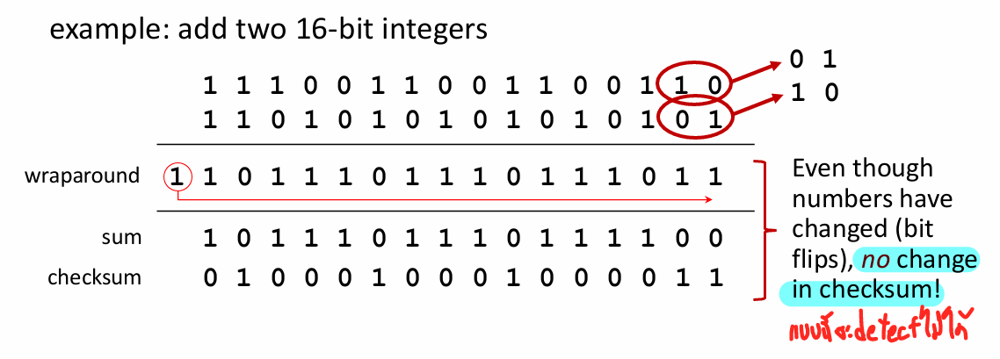

## Principles of Reliable Data Transfer
- Sender, receiver do not know the 'state' of each other, unless communicated via message
### rdt concept
Reliable Data Transfer protocol (rdt): consist of 4 main functions
-  `rdt_send()`: called from application layer to pass data
- implement sender-side rdt reliable data transfer protocol
-  `udt_send()`: called by rdt to transfer data over unreliable channel
-  `rdt_rcv()`: called when packet arrives
- implement receiver-side rdt reliable data transfer protocol
-  `deliver_data()`: called by rdt to deliver data to application layer

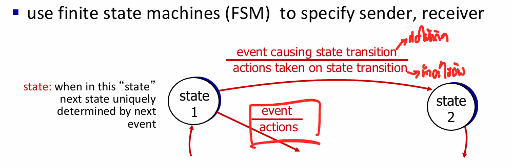

- `rdt 1.0`: perfect reliable, 4 functions enough
- `rdt 2.0`: with bit error (detected by checksum), recovery by **resend**
  - when to resend -> 2 signals used `ACKs`and `NAKs`
    - `Acknowledgements (ACKs)`: receiver tell sender that packet OK
    - `Negative acknowledgements (NAKs)`: receiver tell sender that packet not OK-> resend
  - **Stop-and-Wait Protocols**:
    - Sender waits for acknowledgment before sending the next packet.
    - Inefficient due to idle time.
- `rdt 2.1`: 
  - ACKs and NAKs have bit error -> checksum
  - Duplicate packet -> sequence number : (0,1) enough cuz now ส่งทีละอัน
- `rdt 2.2`: NAK-free protocol, use ACKs only 
  - ส่ง seq # ล่าสุดที่โอเคด้วย so if seq # duplicate mean resend current pkt.
- `rdt 3.0`: With errors and loss
  - sender waits amount of time for ACK, exceed -> resend, even duplicate seq # still handle it.

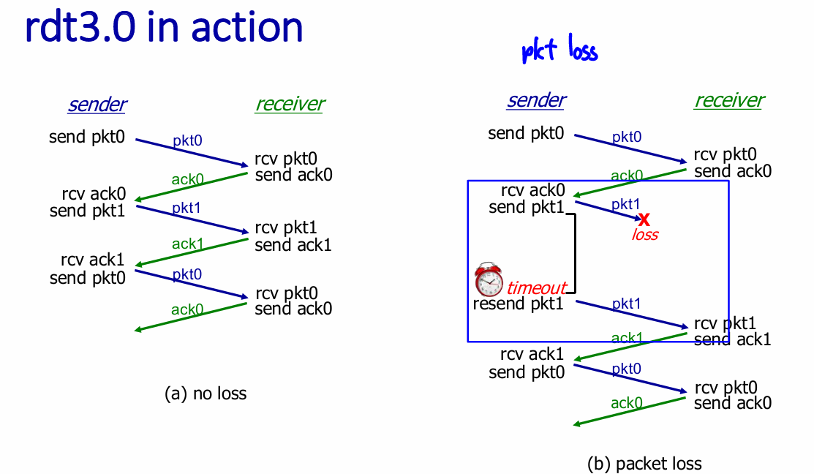
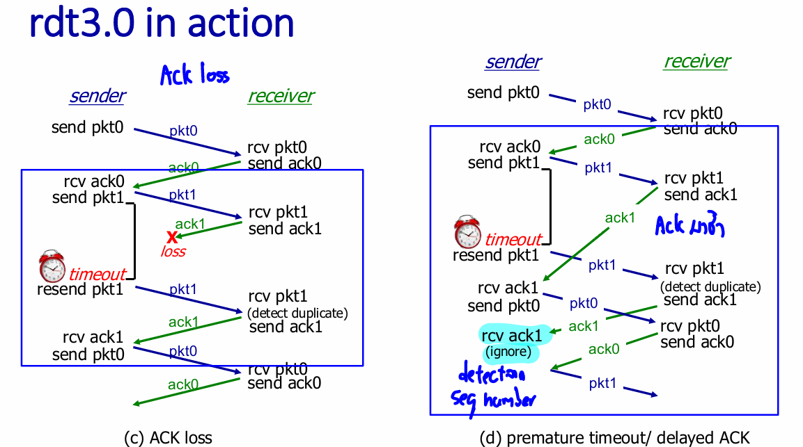

- Utilization : fraction of time sender busy, stop and wait limit performance
- **Pipelined Protocols**: 
  - Allow multiple packets to be sent เพิ่ม seq #, เพิ่ม buffer ทั้ง sender/receiver.
  - Two main types:
    - **Go-Back-N (GBN)**: 
      - sender : window up to N, consecutive transmitted but unACKed pkt
        - Cummulative ACK: ACK(n): ACK ตั้งแต่ 0 ถึง n เมื่อได้รับค่อยเลื่อนไป n+1 = 0
        - timer for oldest in-flight pkt, timeout(n) resend all seq # n and higher pkt in window
      - receiver : send ACK with highest in-order seq #
        - out-of-order pkt: save in buffer, or discard
  
    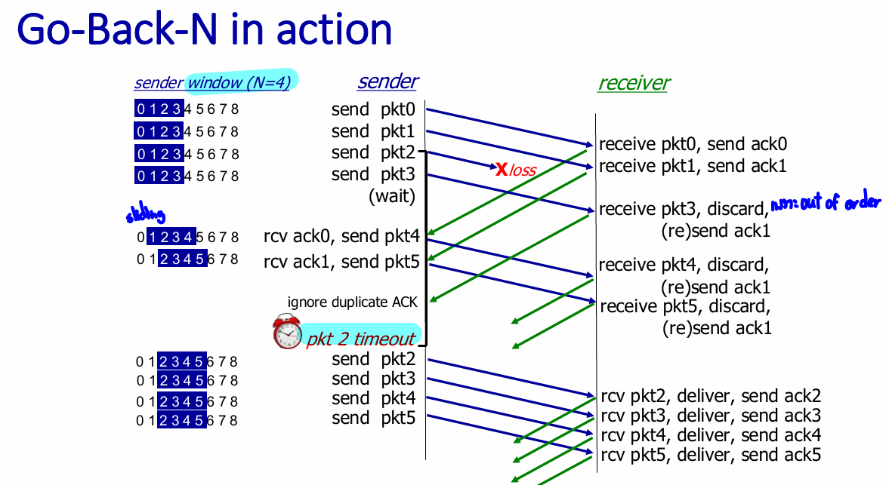

    - **Selective Repeat (SR)**: multiple pkt in flight
      - timeout(n), ACK(n) คือ n pkt เดียว individually
      - sender timer for each unACKed pkt, retransmits single pkt
        - send_base : ตัวที่ยังไม่ ACK ที่เก่าสุด, sliding window เมื่อมัน ACK
        
      - receiver individually ACKs (not commulative)
        - rcv_base : ตัวที่ยังไม่มาที่เก่าสุด, sliding window เมื่อมันมา
        - buffer ทุก pkt ที่ได้รับถูกต้องแต่ deliver to upper-layer when in-order
      
      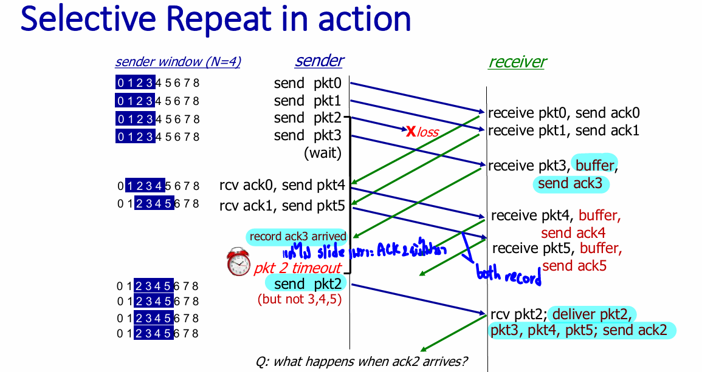

      - window ต้องมีขนาดใหญ่เป็นอย่างน้อย 2 เท่าของ seq # 

      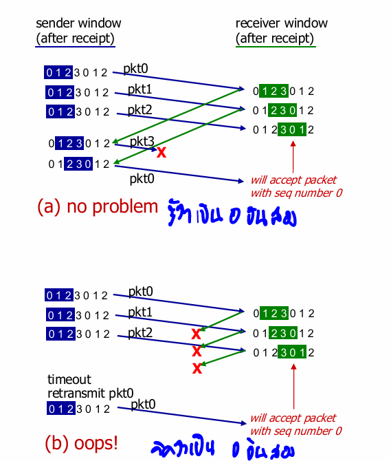
      

## Connection-Oriented Transport: TCP
- **Transmission Control Protocol (TCP)**:
  - point-to-point: one sender, one receiver
  - Reliable, in-order
  - Connection-oriented protocol (handshaking)
  - Full duplex data : bidirectional data flow in same connection
  - Commulative ACKs : **but little bit different**
  - Pipelining : congestion and flow control (set window size) not overwhelm network and receiver 

  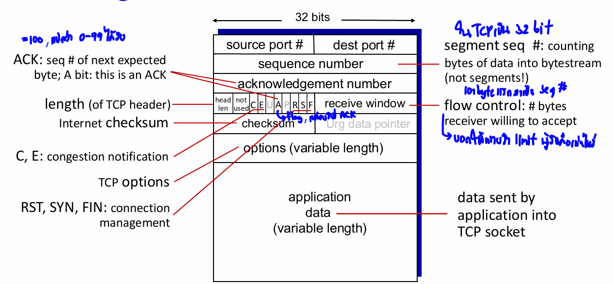

### TCP round trip time, timeout
- Timeout : longer than RTT, but RTT is vary
  - Too short -> unnecessary resend, Too long -> slow reaction to segment loss
- Estimate RTT
  - SampleRTT : measured time , usually vary
  - for smooth RTT EWMA : Exponential Weighted Moving Average  and α (default : 0.125)
    $$ EstimatedRTT = (1- α)*EstimatedRTT + α*SampleRTT$$
  - Then add Safety margin, $\beta$ (default : 0.25)
    $$ TimeoutInterval = EstimatedRTT + 4*DevRTT$$
    $$ DevRTT = (1-\beta)*DevRTT + \beta*|SampleRTT - EstimatedRTT|$$

### Receiver : decrease ACK around 50 % with this process
- เมื่อได้รับอย่างถูกต้องจะยังไม่ส่ง ACK ทันที รอ 500ms
- ถ้าอันต่อไปมาอย่างถูกต้องส่ง ACK ทันที
- ขาดหายจะส่ง duplicated ACK ทันที ให้ resend
- ของที่ขาดมารีบส่ง ACK จะได้เลื่อน window + deliver

### Sender
- **Fast Retransmit and Recovery**: รอ timeout มันนาน 
  - Retransmits lost segments after receiving three duplicate ACKs ทันทีไม่รอ timeout.

### TCP flow control
- ไม่ให้เกิน limit ผู้รับ，ใน TCP segment มี field receive window (rwnd) บอกพื้นที่ buffer ว่างให้ sender

### TCP connection management
before exchanging data, sender/receiver "handshake"
  - agree to establish connection (โอเคที่จะเชื่อมไหม)
    - 2-way handshake : อยู่มั้ย -> อยู่ （เริ่มส่งข้อมูลได้）
      - Problem half open : req delay นานเกินจนจบ connection, client หาย
        - อยู่มั้ย -> อยู่ (หาตัว client ไม่เจอ) อ้าว โดนบิด 
    - 3-way handshake : อยู่มั้ย -> อยู่, แล้วมึงอยู่มั้ย -> อยู่ (เริ่มส่งข้อมูลได้)
  - agree on connection parameters (starting seq #)
  - Closing TCP connection each close their side of connection FIN bit = 1 (in TCP segment)
    - FIN : กูไม่ส่งไรละ
    - ACK : KK

## Principles of Congestion Control
- Congestion occurs when too much data overwhelms the network.
  - long delay : queueing in router buffer
  - packet loss : buffer overflow
- Ideal case : infinite buffer 

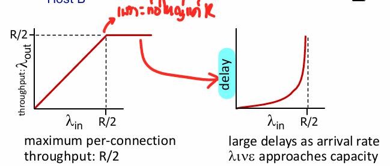

- Realworld case : finite buffer + costs of congestion 
  - needed retransmit 
  - un-needed duplicate (delay ACK)

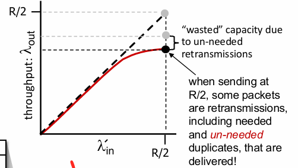

- Congestion corrupt : capacity and buffering ถูกใช้อย่างเปล่าประโยชน์

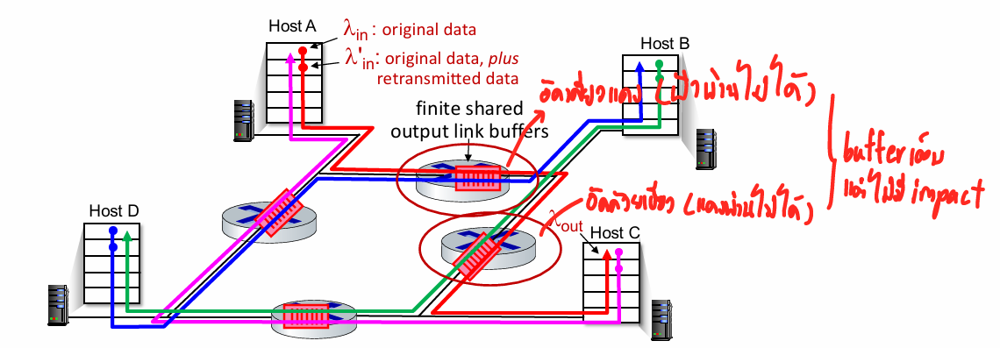

- **Approaches to Congestion Control**:
  - **End-to-End Control**: Sender adjusts based on สังเกต congestion จาก loss, (e.g. TCP) .
  - **Network-Assisted Control**: Routers provide feedback to senders (บอก congestion level/set sending rate).

## TCP Congestion Control
- TCP dynamically adjusts sending rates based on network feedback.
  - initially cwnd = 1 MSS -> 2 MSS -> 4 MSS (doubled cwnd every RTT)
- **AIMD** (Adaptive Increase/Decrease) algorithm: increase sending rate until packet loss (congestion) occurs, then decrease sending rate.

- **Multiplicative decrease**: ลดได้ 2 แบบ
  - Triple duplicate ACK (TCP Reno) : cut in half (ยังไม่หนักเพราะอันต่อไปยังไปถึงได้)
  - Timeout : cut to 1 MSS (maximum segment size)
- **Congestion window (cwnd)** : send_window , dynamically adjust 
- TCP rate unit : bytes/sec
$$TCPrate = \frac{cwnd}{RTT}$$

- **TCP Slow start** : begin increase rate exponentially until first loss_event/threshold then get into AIMD

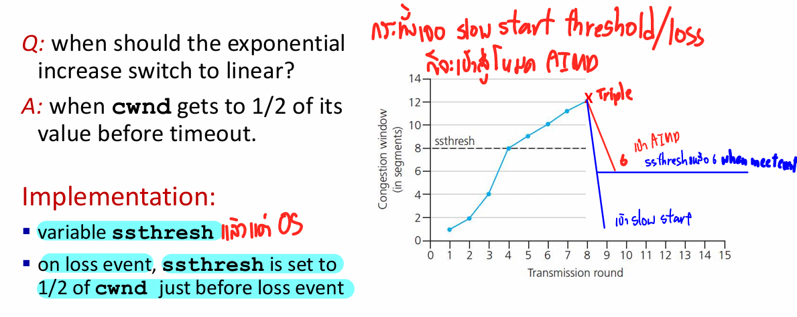

- **Delay-based TCP congestion control** : ใช้ Delay detect มาควมคุมแทน loss
- **Explicit congestion notification (ECN)** : แจ้งล่วงหน้าก่อน loss เกิด เพื่อลดปริมาณ retransmission
- **TCP Fairness** : K TCP session share bandwidth R each should have avg rate of R/K
  - specific time not fair, but avg fair

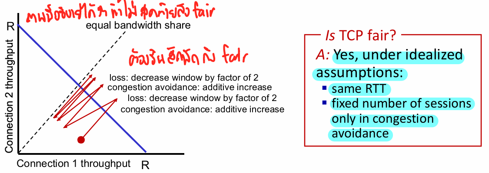

- But still have approach which lead to unfair for each application
  - Parallel TCP : application open multiple TCP connection
## HTTP/3 : QUIC 
Moving some TCP function to application layer on top of UDP, 

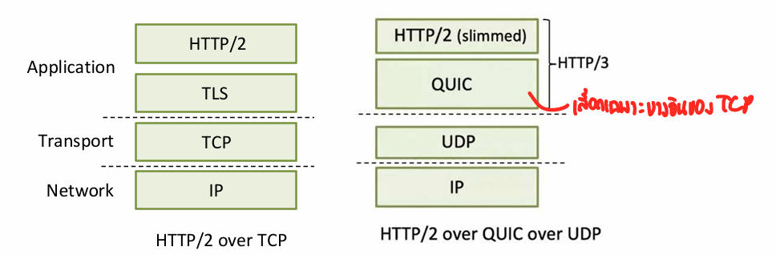

- **Error and congestion control is still TCP**
- **Connection establishment** reliability, congestion control, authenication, encryption, state established in **one RTT**

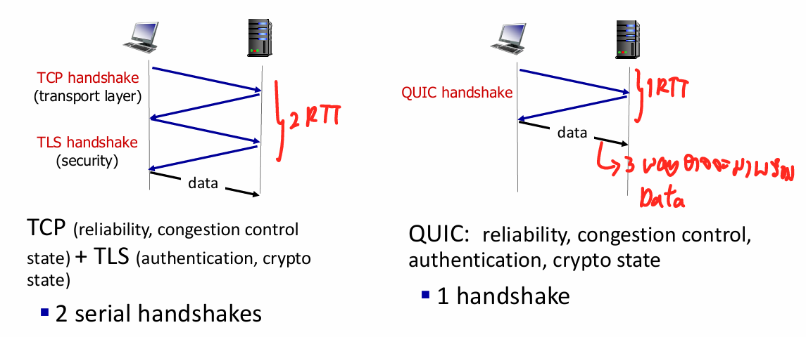

- **Streams** : parallelism, no HOL blocking independent ในการส่ง 
  - multiple application-level `streams`  multiplexed over single QUIC connection

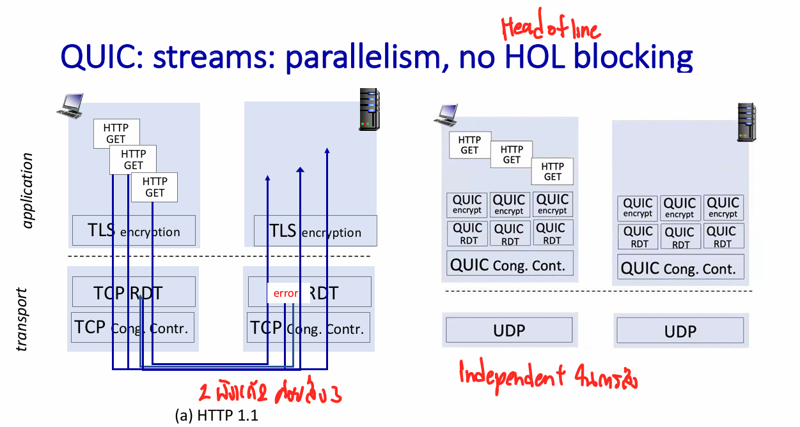

## TCP CUBIC
ramp to max faster but slow down after
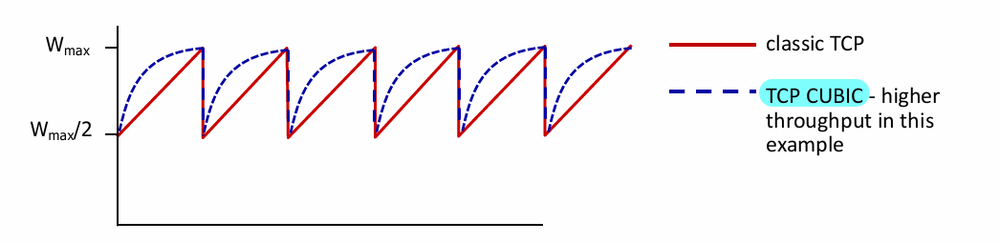

